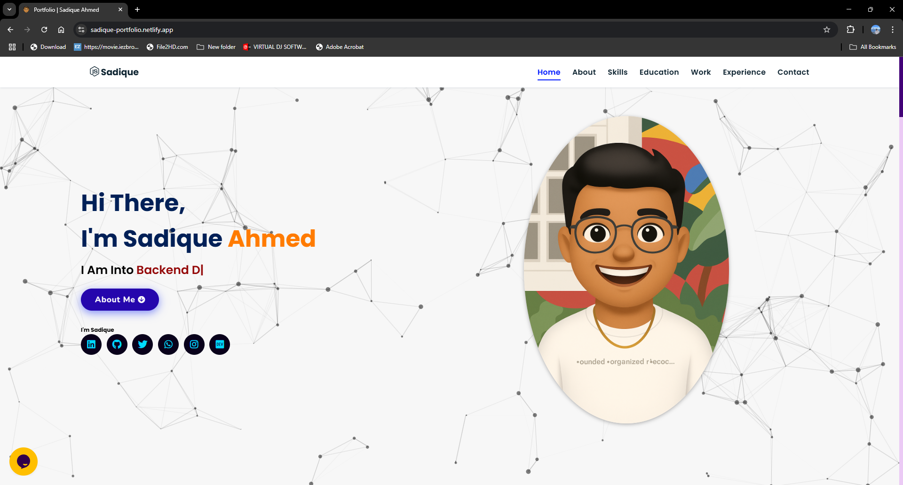

# 💼 Sadique Ahmed's Portfolio

Welcome to my personal portfolio website repository! This project showcases my journey, skills, and projects as a full-stack developer. It's designed to provide a comprehensive overview of my professional profile and technical expertise.

## 🌐 Live Demo

Check out the live version of the portfolio here:  
🔗 [sadique-portfolio.netlify.app](https://sadique-portfolio.netlify.app)

Here’s a preview of the portfolio:



## 📁 Project Structure

The repository is organized as follows:

- `index.html` – Main HTML file serving as the entry point.
- `assets/` – Contains images, icons, and other static assets.
- `projects/` – Details of projects I've worked on.
- `experience/` – Information about my professional experience.
- `skills.json` – Structured data representing my skill set.

## 🛠️ Technologies Used

The portfolio is built using the following technologies:

- HTML5
- CSS3
- JavaScript

## 🚀 Getting Started

To run the project locally:

1. **Clone the repository:**

   ```bash
   git clone https://github.com/Sadiqueahmed/Portfolio.git

2. **Navigate to the project directory:**

   ```bash
   cd Portfolio

2. **Open `index.html` in your preferred web browser.**

   You can simply double-click the `index.html` file or use a live server extension if you're using VS Code.

## 📬 Contact

Feel free to reach out if you have any questions or opportunities:

- 📧 Email: [sadiqueahmed40@gmail.com](mailto:sadiqueahmed40@gmail.com)
- 💼 GitHub: [@Sadiqueahmed](https://github.com/Sadiqueahmed)

## 📄 License

This project is open-source and available under the [MIT License](LICENSE).


